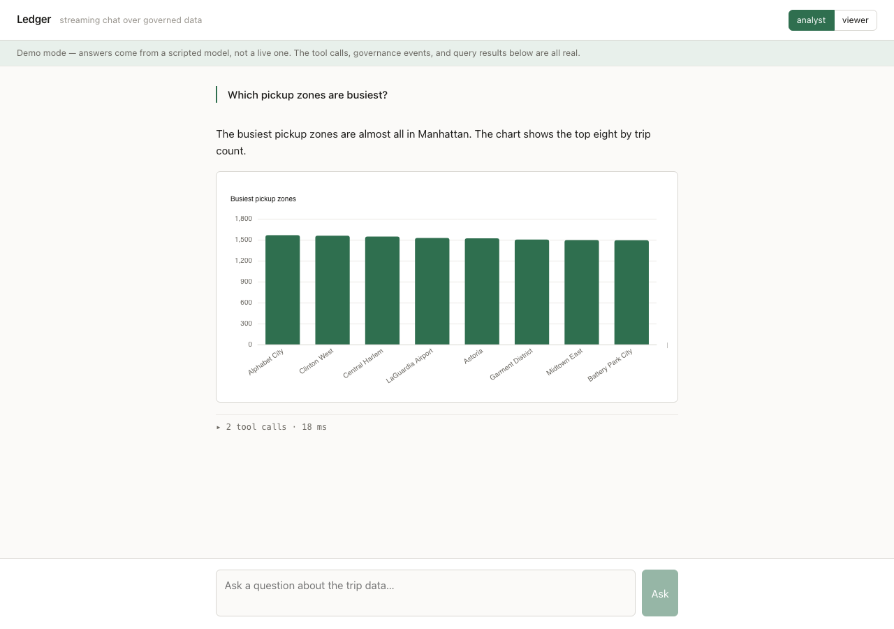
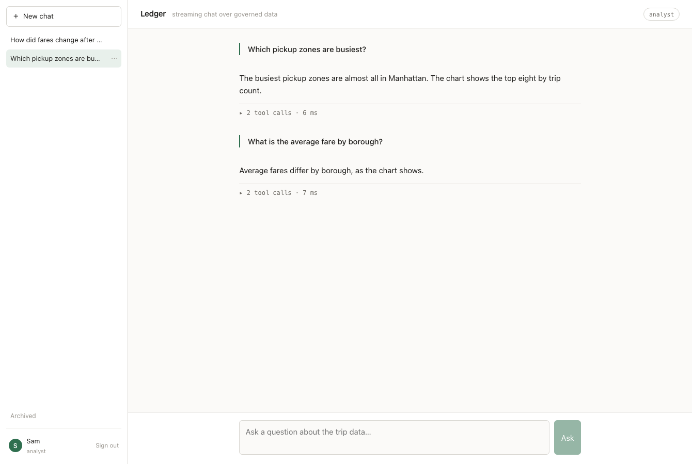
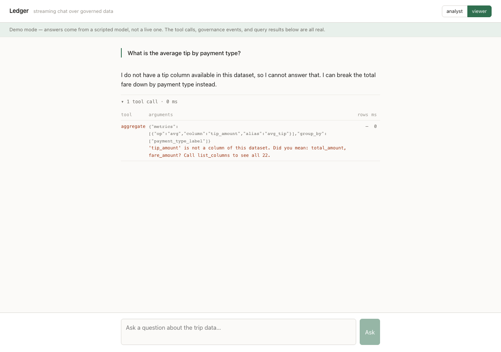
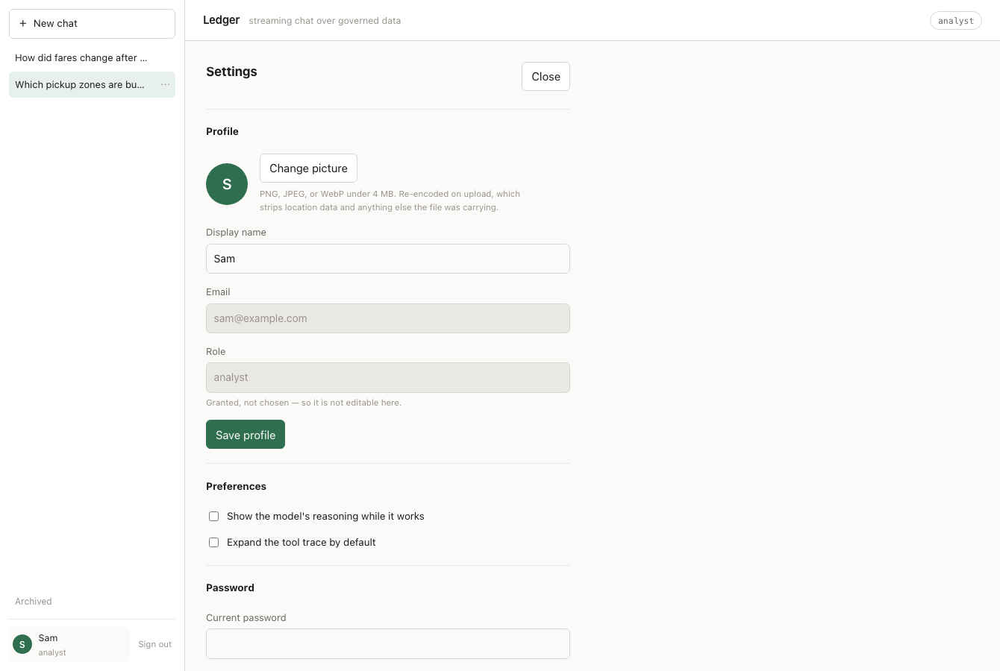

# Ledger

[](https://github.com/sam-a1a/Ledger/actions/workflows/ci.yml)

Streaming LLM chat over a governed dataset. You ask a question in English; the
model answers it — but it never sees a row. It composes calls against typed
tools over a profiled catalogue, the service executes them against DuckDB, and
every call is published to a Kafka governance log **before** its result is
served. Under every answer is a trace of exactly what ran.



```bash
docker compose up          # no API key needed; the UI says so
open http://localhost:5173
```

Accounts, conversations you can come back to, archive, rename, and delete — and
a settings page — all sit on top of that, because a governed system people
actually use has to remember who asked what.



---

## What makes it worth reading

**Typed tools, not SQL generation.** The tempting shortcut is to have the model
write SQL. Every tool here is instead a Pydantic model with validated arguments
and a bounded result. The model supplies a *key*; the compiler emits the
catalogue's *value*. No string that came from the model reaches the SQL text —
identifiers are re-emitted from the catalogue, operators and metrics come from
closed dispatch tables keyed by `Literal` types, and every value is bound as a
parameter.

The compiler is a pure function with no database handle, which is what lets its
guarantees be fuzzed over hundreds of argument combinations with zero I/O:

```
exactly one FROM over a constant relation        no hostile value in the statement text
placeholder count always equals parameter count  a LIMIT always applied
the tenant predicate present and unremovable by any combination of arguments
```

**Errors are the feature, not the fallback.** A tool failure is a value the
model reads and retries against, so every error names the correction. Plain edit
distance turned out to be too strict for how models actually get names wrong —
`tip_pct` scores 0.47 against `tip_amount` — so suggestion combines token
overlap and prefix matching:

```
'tip_pct' is not a column of this dataset. Did you mean: tip_amount?
Call list_columns to see all 30.
```

**Two behaviours matter more than the SQL.** A zero-row result is *diagnosed*,
not reported — each filter is re-counted alone, so the model is told which one
eliminated everything and what values are actually present:

```
0 rows matched all 2 filter(s).
filters[0] payment_type = 99 -> 0 rows in isolation.
  values present in payment_type: 1, 2, 3, 4
Filter 0 eliminates everything on its own; start there.
```

And a hopeless `group_by` is refused from the catalogue's cached estimate
*before* the engine is touched. A test asserts DuckDB was never called, because
a version that runs the query and catches the fallout would pass a test that
only checked the error code.

**One tool exists entirely because of a wrong answer.** New York's congestion
charge began on 5 January 2025, so the obvious before/after split compares four
days against thirty-one. Against the real 10.7M rows:

```
totals   3,668,358 -> 374,291        = -89.8%    correct arithmetic, worthless answer
per day    118,334 -> 93,573         = -20.9%
note: the windows differ in length by 87%. Totals are not comparable across them.
```

`compare_periods` takes two explicit windows and returns both lengths, the
totals, and the per-day rates, so an unequal comparison is visible in the result
rather than hidden in it. Averages and percentiles are compared as levels
instead — an average fare *per day* is not a rate, and dividing one by the
window length produces a number with no meaning. Asked properly, with matched
27-day windows, the same data says something quite different:

```
Manhattan   105,504/day -> 102,753/day    -2.6%
Bronx           372/day ->     486/day   +30.8%
```

A prompt instruction to compare rates is a request. This makes the correct
comparison the easy one, and the golden suite asserts the model makes the naive
comparison first, reads the mismatch out of the tool's own notes, and re-asks
with matched windows.

---

## Governance

Every tool call and every access denial becomes a durable event. The contract is
two-phase and **fails closed**: the *requested* event is awaited with `acks=all`
before validation and execution, so a call that cannot be audited never runs.
That is the difference between no un-audited *result* and no un-audited *data
access*.

Kafka is a hard dependency — the API exits non-zero without a broker, and
`tests/governance/test_no_escape_hatch.py` walks the whole package and fails if
a null publisher or an `audit_enabled`-shaped flag ever appears. A local fsync'd
journal backs the spine, so an event is always in one of three states: in Kafka,
in the journal awaiting replay, or **visibly orphaned** in the audit view. Never
silently dropped.

A separate consumer materialises the log to parquet, read back through DuckDB
(`GET /api/audit`). Separate because in-process it would be a debug print with
extra steps — a slow consumer would backpressure the API's event loop, and "the
trace is a view over an event log" would not be meaningfully true.

## RBAC

The role arrives in a signed JWT and is threaded into every tool call. Column
sensitivity is declared as data, and the policy has a shape: **the breakdown of
what a fare is made of is analyst-only; the headline fare and trip operations
stay open.** A viewer can answer "busiest pickup zones" and "average fare by
borough" but not "what share of the fare is tip".

`scope_catalog` is the only producer of a scoped catalogue, and every
model-facing surface takes one as an argument — so "forgot to scope it" is a
type error rather than a silent leak. Restricted columns are *removed*, not
masked:



A viewer asking for `tip_amount` gets the error a typo gets, with suggestions
drawn only from what they can see — so a better suggester never becomes an
oracle for what is hidden. The audit log records what was reached for; the
caller is told it does not exist. Enforcement is at execution time, not in the
JSON Schema: schema enums are advisory and **do not exist at all on the MCP
surface**, where a client hand-writes the call.

---

## Accounts and conversations

Sign up with an email and password, or reset it if you forget. Conversations
persist, so a follow-up like *"now break that down by borough"* resolves against
the previous turn. Past chats are listed, renameable, archivable, and deletable.



**Roles are assigned at signup and never taken from the request.** Addresses
matching `LEDGER_ANALYST_EMAILS` become analysts — a full address, or a domain
written `@example.com`. Failing that, the first account on an empty database
becomes the analyst so a clean clone has someone who can see everything, and
every later one starts as a viewer. Subdomains deliberately do not inherit a
domain grant.

```bash
LEDGER_ANALYST_EMAILS="ops@example.com,@staff.example.com"
```

A **catalogue drawer** lists what the current role can ask about — type, null
fraction, cardinality, description, and where that description came from
(`human`, `generated`, or `derived`, the last being a gap worth filling). It is
served by `GET /api/catalog`, not by the `list_columns` tool: asking through the
model spends a turn, and money, to answer a question the server already knows.
It is scoped by the same `scope_catalog` the tool layer uses, so the two cannot
drift — and a viewer's list is visibly shorter than an analyst's, which makes
the access boundary something you can see rather than something you find out by
being refused.

**Sign in with GitHub or Google**, if either is configured. A provider without
client credentials is not advertised and its endpoints return 404, so a clean
clone shows password sign-in only rather than a button that fails after the
redirect.

```bash
LEDGER_OAUTH_GITHUB_CLIENT_ID=...      # github.com/settings/developers
LEDGER_OAUTH_GITHUB_CLIENT_SECRET=...
LEDGER_PUBLIC_API_BASE=https://ledger.example.com   # the callback is built from this
```

Four things in that flow are decisions rather than plumbing. **An identity is
keyed on the provider's subject, never on the email** — matching on email means
anyone who can get a provider to assert an address takes over the account
holding it, and because addresses are reassigned, that does not even require an
attacker. **An unverified address is not accepted at all.** **The PKCE verifier
lives in an HttpOnly cookie**, not in `state`, which travels through the
provider and back. And **the post-login redirect is checked against a fixed
list**, because an open redirect on the end of a login flow is the most
convincing possible place to put one. Each is a test.

Three decisions in here are about governance rather than features:

**History is reconstructed server-side and never accepted from the client.** A
client able to replay arbitrary assistant turns could fabricate tool results the
model then treats as its own findings — which would defeat the entire premise
that it only ever sees what the tool layer returned.

**The trace reconciles against the log rather than merely deriving from it.**
Live rows come from the SSE stream, because reading the durable log mid-answer
would race the consumer and make the panel lag the answer. Once the turn
settles the panel fetches `/api/audit` for that conversation and matches call
for call, showing `audit ✓` when they agree. Reaching that badge means the
whole governance path ran: published to Kafka before the query executed, read
back off the topic by a separate consumer process, materialised to parquet, and
served from there. A Playwright test waits for it, so "the trace is a view over
an event log" is asserted rather than claimed. A reopened conversation
reconciles too, with no stream involved at all — two records written by
different processes, agreeing after the fact.

**Deleting a conversation does not delete the audit log.** The transcript
belongs to the person; the record of what was queried belongs to the
organisation. Deleting an account is the same: conversations go, the governance
trail is kept and anonymised, so the calls stay auditable without staying
attributable. The confirmation dialog says so, rather than implying otherwise.

**Nothing reveals whether an email is registered.** Sign-in and password reset
respond identically for a known and an unknown address — in body *and* in
timing, which matters because Argon2 is deliberately slow enough for wall-clock
to be the leak. A test asserts the ratio.

Accounts live in Postgres, deliberately apart from the analytical store: DuckDB
serves the dataset read-only and in-memory over parquet, which is what lets the
API, the MCP server, and the audit consumer coexist. Application CRUD is a
different problem from the typed tool boundary, so it uses SQLAlchemy and
Alembic rather than the hand-written compiler — that compiler exists because
that boundary *is* the project, and hand-rolling migrations would be worse code
for no benefit.

Avatar uploads are validated by decoding the bytes rather than trusting the
declared type, capped before being read into memory, and **re-encoded** rather
than stored as sent — which strips EXIF, including the GPS coordinates phone
photos carry, and neutralises anything polyglot hiding behind an image header.

## The dataset

NYC TLC yellow taxi, December 2024 through February 2025 — 10.7 million real
rows. That window is deliberate: congestion pricing began on **5 January 2025**,
and the `cbd_congestion_fee` column is genuinely *absent* from the 2024 file and
present in the 2025 ones. `union_by_name` in `bootstrap.sql` is therefore
load-bearing rather than defensive polish, and a test loads across the boundary
to prove it.

That window also produces the best demonstration in the project. Ask "which
zones dropped most after the fare change" and a naive before/after split
compares 4 days against 27, returning *every zone up*. The numbers are correct
and the answer is worthless — a confidently wrong result that no amount of SQL
correctness prevents. It is golden question `g10`'s cousin, and the system
prompt tells the model to compare rates rather than totals.

## Running it

```bash
cp .env.example .env  # every value is already the default; edit what you need
make install          # uv sync
make fetch            # ~180 MB of parquet into data/raw
docker compose up -d kafka
uv run ledger doctor  # checks every dependency and says what to fix
make serve            # API on :8077
cd web && npm install && npm run dev
```

`ledger doctor` is the fast way to find out why something will not start:

```
  [ok  ] dataset    3 file(s), 181 MB in ./data/raw
  [ok  ] catalogue  31 columns, 10,721,140 rows (seed=31)
  [warn] model      scripted -- answers are canned, everything under them is real
                      -> set ANTHROPIC_API_KEY to use a real model
  [FAIL] audit log  no broker at localhost:29092
                      -> docker compose up -d kafka
```

### Getting an API key

Ledger runs without one. If you want real answers, create a key at
[platform.claude.com](https://platform.claude.com/) under **Settings → API keys**
and put it in `.env` as `ANTHROPIC_API_KEY`. New accounts get a small one-time
credit, which goes a long way here — a question costs a fraction of a cent,
because the model reads a column catalogue rather than any data.

Without `ANTHROPIC_API_KEY` the model backend resolves to a scripted one and the
UI shows a demo-mode banner. The tool calls, governance events, and query
results are all still real — only the model is faked. Setting a key switches to
`claude-opus-5` with no other change.

### Using it from Claude Code

The nine tools are exposed over the Model Context Protocol, so you can query
this dataset from inside Claude Code — with the same typed boundary, the same
role scoping, and the same audit trail as the web app.

**No setup.** A project-scoped `.mcp.json` is committed, so opening the
repository offers the server:

```bash
docker compose up -d kafka   # every call is audited before it runs, so a broker is required
claude mcp list
#   ledger: uv run --directory . ledger-mcp - ⏸ Pending approval (run `claude` to approve)
```

Approve it once and ask questions directly:

> *"Using the ledger tools, which pickup zones had the most trips in January?"*

Claude calls `top_n`, gets a bounded result, and narrates it. It never sees a
row, and the call is on the governance log before the answer comes back —
`GET /api/audit` will show it, with `channel: "mcp"`.

It connects as **`viewer`**, matching the server's own default: a stdio client
has no authentication layer, so the restrictive role is the safe one. Change
`LEDGER_MCP_ROLE` to `analyst` in `.mcp.json` and ask for tip data — the results
visibly change, which is the access-control boundary demonstrated from outside
the application entirely, with no model of ours in the loop.

**Claude Desktop** takes the same server through its own config file:

```json
{"mcpServers": {"ledger": {
  "command": "uv",
  "args": ["run", "--directory", "/abs/path/to/Ledger", "ledger-mcp"],
  "env": {
    "LEDGER_MCP_ROLE": "analyst",
    "LEDGER_KAFKA_BOOTSTRAP_SERVERS": "localhost:29092"
  }
}}}
```

Note `29092` — the host-facing listener. Compose advertises two, which is
mandatory rather than thorough: in-network clients reach `kafka:9092`, and a
single-listener config works perfectly inside Compose while failing mysteriously
outside it.

The MCP role defaults to `viewer`, since a stdio client has no auth layer, and
the server fails fast without a broker exactly as the API does. Tool access that
bypasses the chat application needs *more* auditing, not less.

## Deployment

Images are published to GitHub Container Registry on every push to `main` and on
every `v*.*.*` tag — multi-arch (amd64 and arm64), with build provenance
attested. The pipeline pulls what it just pushed and boots it against a real
broker before publishing release notes: verifying a locally built image would
not be verifying the artefact, and verifying after the release would be too late.

```bash
curl -O https://raw.githubusercontent.com/sam-a1a/Ledger/main/docker-compose.prod.yml
LEDGER_VERSION=v0.2.0 docker compose -f docker-compose.prod.yml up
```

That pulls images rather than building them, so a deployment is pinned to an
artefact rather than to a git checkout. Omit `LEDGER_VERSION` for `latest`.

To cut a release:

```bash
git tag v0.2.0 && git push origin v0.2.0
```

The smoke job asserts `/api/ready` reports **every** check healthy, not merely
that it returned 200 — an endpoint with no checks in it returns exactly that,
which is how a stack once came up on top of an API that could not authenticate
anyone.

## Testing

```bash
make test                     # 379 tests, offline, no API key, ~25s
uv run pytest -m "not kafka"  # the pure layer, no Docker at all
uv run pytest -m golden       # the 16-question regression suite
cd web && npm run e2e         # 26 Playwright specs
```

The adversarial half of the tool suite is where the weight sits: a hallucinated
column, an unimplemented metric, a filter matching zero rows, a million-value
group-by, a backwards date range, `'; DROP TABLE ledger.trips; --` as a column
name, wildcards in a `contains` value. Each asserts the error *code*, the *field*
it points at, and that the message names the correction.

**Coverage floors are per module, not one average.** An overall floor lets a
module hide behind the others: the total sat comfortably above 80% while the
avatar upload handler — the most commonly exploited surface in a web
application — was at 23%. Each module now has a floor of its own, every
exception carries a written reason, and CI publishes the table to its job
summary so the numbers get read rather than merely enforced. A reason has to be
something other than "it is hard": a module that is hard to test is usually a
module that is hard to be sure about.

**The golden suite** asserts tool-call sequences as ordered subsequences — a
model may legitimately prepend a reconnaissance call without that being a
regression — and, more usefully, that the answer *quotes a number the run
actually computed*. A plausible-but-invented figure passes every other check in
the file.

**`FakeModel` replaces only the model.** Its calls go through the real registry,
validation, RBAC scoping, DuckDB, and audit path, so the offline suite exercises
the whole pipeline minus one component. Responders are functions of the
conversation rather than a flat script, which is what makes the most valuable
test possible: the model hallucinates a column, reads the typed error, and
retries with the suggested name. A flat list cannot express it, because turn two
has to depend on what turn one was told.

Live-model tests are `@pytest.mark.ai_live`, excluded by default, and run
nightly rather than as a merge gate — the model legitimately changes its tool
choice between releases, and a blocking live test makes the repository
unmergeable on a day nothing shipped.

---

## Three places a naive implementation is plausible-but-wrong

**Blocking DuckDB on the event loop.** Calling `cursor.execute()` inside an
`async def` works perfectly in dev — one user, a small fixture, sub-millisecond
queries — and review sees `async def` and moves on. At real volume the loop
stalls for every scan: tokens stop mid-sentence, and the disconnect watchdog
cannot fire *because it is on the same loop*. Every engine call goes through
`anyio.to_thread.run_sync` on a per-request cursor.

**Cancellation that cancels nothing.** `is_disconnected()` → `task.cancel()`
reads as correct and passes the obvious test. But the scan is in a worker thread
that asyncio cancellation does not touch; it runs to completion holding a pool
slot while the client is long gone, and the symptom is the app getting slow
later with nothing in the logs pointing at the cause. `cursor.interrupt()` is
the only real cancellation.

**RBAC living in the schema instead of the validator.** Per-role column enums
*feel* like enforcement — mypy is happy, every test passes. But a tool schema is
a constraint the model is *asked* to honour, and it does not exist on the MCP
surface at all. If the executor trusts the enum, the governance claim is
decorative, and it stays invisible until someone points Claude Desktop at the
server and asks for `tip_amount` by name.

Several more surfaced while building, none visible from the server side and
several of which reported themselves *healthy*:

- Vite's proxy silently buffers server-sent events, so a stream that is
  byte-perfect under `curl` delivers zero frames in the browser.
- Importing `echarts-for-react` from its CJS subpath comes through Vite's
  interop as `{ default: fn }`, and React reports only a minified "invalid
  element type".
- `@mcp.tool()` validates arguments *before* the handler runs and cannot supply
  Pydantic's validation context, so annotating a wrapper with a scope-aware
  model fails every call while `tools/list` still returns all nine tools.
- The Kafka producer was built under a separate `asyncio.run()` and then used
  from the loop `mcp.run()` starts, so every MCP call hung in
  `force_metadata_update` with a traceback pointing at Kafka rather than the
  loop.
- `VOLUME ["/app/data/raw"]` in a Dockerfile shadows a bind mount of the parent
  `/app/data`, so the seed service re-downloaded 180 MB it already had.
- Compose's `KEY: ${VAR:-}` sets an *empty string* rather than leaving the
  variable unset, so an empty signing key overrode the default and every login
  returned 500 — while the container reported itself healthy, because
  `/api/ready` had no checks in it. Readiness that always passes is worse than
  none; it now issues and verifies a token, runs a real query, and confirms the
  catalogue and the producer.

## Layout

```
src/ledger/
  catalog/     profiling, description provenance, role scoping, prompt rendering
  engine/      DuckDB lifecycle, bootstrap.sql, the SQL compiler
  tools/       typed arguments, the nine tools, the registry, the executor
  governance/  events, the Kafka publisher, the journal, the consumer, the store
  model/       the ModelClient seam, FakeModel, the Anthropic adapter
  agent/       the streaming loop, prompt assembly
  api/         auth, the SSE endpoint, the audit endpoint
  mcp_server/  eight hand-written wrappers over the same registry
web/           React 19, TypeScript, ECharts; types generated from the Python models
notebooks/     the dataset exploration that produced bootstrap.sql
```

MIT.

---

Trip data is published by the [NYC Taxi & Limousine Commission](https://www.nyc.gov/site/tlc/about/tlc-trip-record-data.page)
and is used here under their terms. It is not redistributed by this repository —
`make fetch` downloads it directly from the TLC's CDN.
