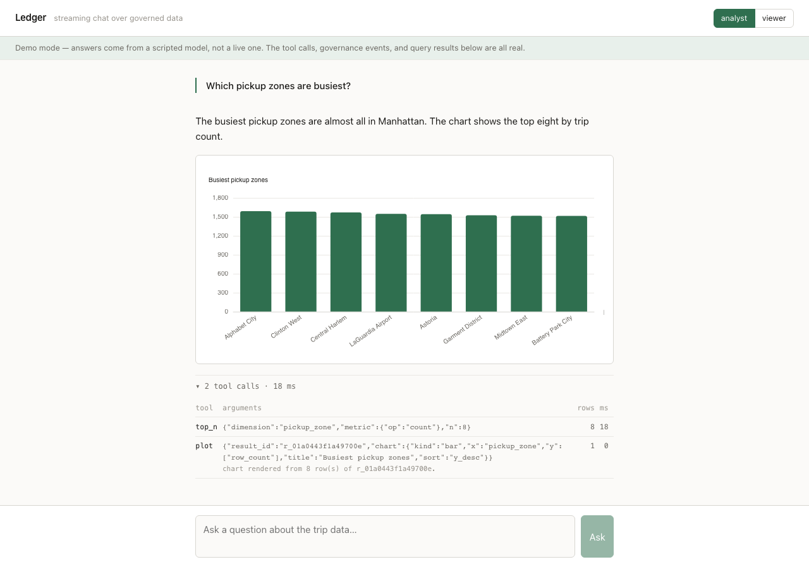

# Ledger

[](https://github.com/BassamGhazaleh/ledger/actions/workflows/ci.yml)

Streaming LLM chat over a governed dataset. You ask a question in English; the
model answers it — but it never sees a row. It composes calls against typed
tools over a profiled catalogue, the service executes them against DuckDB, and
every call is published to a Kafka governance log **before** its result is
served. Under every answer is a trace of exactly what ran.



```bash
docker compose up          # no API key needed; the UI says so
open http://localhost:5173
```

---

## What makes it worth reading

**Typed tools, not SQL generation.** The tempting shortcut is to have the model
write SQL. Every tool here is instead a Pydantic model with validated arguments
and a bounded result. The model supplies a *key*; the compiler emits the
catalogue's *value*. No string that came from the model reaches the SQL text —
identifiers are re-emitted from the catalogue, operators and metrics come from
closed dispatch tables keyed by `Literal` types, and every value is bound as a
parameter.

The compiler is a pure function with no database handle, which is what lets its
guarantees be fuzzed over hundreds of argument combinations with zero I/O:

```
exactly one FROM over a constant relation        no hostile value in the statement text
placeholder count always equals parameter count  a LIMIT always applied
the tenant predicate present and unremovable by any combination of arguments
```

**Errors are the feature, not the fallback.** A tool failure is a value the
model reads and retries against, so every error names the correction. Plain edit
distance turned out to be too strict for how models actually get names wrong —
`tip_pct` scores 0.47 against `tip_amount` — so suggestion combines token
overlap and prefix matching:

```
'tip_pct' is not a column of this dataset. Did you mean: tip_amount?
Call list_columns to see all 30.
```

**Two behaviours matter more than the SQL.** A zero-row result is *diagnosed*,
not reported — each filter is re-counted alone, so the model is told which one
eliminated everything and what values are actually present:

```
0 rows matched all 2 filter(s).
filters[0] payment_type = 99 -> 0 rows in isolation.
  values present in payment_type: 1, 2, 3, 4
Filter 0 eliminates everything on its own; start there.
```

And a hopeless `group_by` is refused from the catalogue's cached estimate
*before* the engine is touched. A test asserts DuckDB was never called, because
a version that runs the query and catches the fallout would pass a test that
only checked the error code.

---

## Governance

Every tool call and every access denial becomes a durable event. The contract is
two-phase and **fails closed**: the *requested* event is awaited with `acks=all`
before validation and execution, so a call that cannot be audited never runs.
That is the difference between no un-audited *result* and no un-audited *data
access*.

Kafka is a hard dependency — the API exits non-zero without a broker, and
`tests/governance/test_no_escape_hatch.py` walks the whole package and fails if
a null publisher or an `audit_enabled`-shaped flag ever appears. A local fsync'd
journal backs the spine, so an event is always in one of three states: in Kafka,
in the journal awaiting replay, or **visibly orphaned** in the audit view. Never
silently dropped.

A separate consumer materialises the log to parquet, read back through DuckDB
(`GET /api/audit`). Separate because in-process it would be a debug print with
extra steps — a slow consumer would backpressure the API's event loop, and "the
trace is a view over an event log" would not be meaningfully true.

## RBAC

The role arrives in a signed JWT and is threaded into every tool call. Column
sensitivity is declared as data, and the policy has a shape: **the breakdown of
what a fare is made of is analyst-only; the headline fare and trip operations
stay open.** A viewer can answer "busiest pickup zones" and "average fare by
borough" but not "what share of the fare is tip".

`scope_catalog` is the only producer of a scoped catalogue, and every
model-facing surface takes one as an argument — so "forgot to scope it" is a
type error rather than a silent leak. Restricted columns are *removed*, not
masked:


A viewer asking for `tip_amount` gets the error a typo gets, with suggestions
drawn only from what they can see — so a better suggester never becomes an
oracle for what is hidden. The audit log records what was reached for; the
caller is told it does not exist. Enforcement is at execution time, not in the
JSON Schema: schema enums are advisory and **do not exist at all on the MCP
surface**, where a client hand-writes the call.

---

## The dataset

NYC TLC yellow taxi, December 2024 through February 2025 — 10.7 million real
rows. That window is deliberate: congestion pricing began on **5 January 2025**,
and the `cbd_congestion_fee` column is genuinely *absent* from the 2024 file and
present in the 2025 ones. `union_by_name` in `bootstrap.sql` is therefore
load-bearing rather than defensive polish, and a test loads across the boundary
to prove it.

That window also produces the best demonstration in the project. Ask "which
zones dropped most after the fare change" and a naive before/after split
compares 4 days against 27, returning *every zone up*. The numbers are correct
and the answer is worthless — a confidently wrong result that no amount of SQL
correctness prevents. It is golden question `g10`'s cousin, and the system
prompt tells the model to compare rates rather than totals.

## Running it

```bash
make install          # uv sync
make fetch            # ~180 MB of parquet into data/raw
docker compose up -d kafka
make serve            # API on :8077
cd web && npm install && npm run dev
```

Without `ANTHROPIC_API_KEY` the model backend resolves to a scripted one and the
UI shows a demo-mode banner. The tool calls, governance events, and query
results are all still real — only the model is faked. Setting a key switches to
`claude-opus-5` with no other change.

### MCP

```json
{"mcpServers": {"ledger": {
  "command": "uv",
  "args": ["run", "--directory", "/abs/path/to/Ledger", "ledger-mcp"],
  "env": {
    "LEDGER_MCP_ROLE": "analyst",
    "LEDGER_KAFKA_BOOTSTRAP_SERVERS": "localhost:29092"
  }
}}}
```

Note `29092` — the host-facing listener. Compose advertises two, which is
mandatory rather than thorough: in-network clients reach `kafka:9092`, and a
single-listener config works perfectly inside Compose while failing mysteriously
outside it.

The MCP role defaults to `viewer`, since a stdio client has no auth layer, and
the server fails fast without a broker exactly as the API does. Tool access that
bypasses the chat application needs *more* auditing, not less.

## Testing

```bash
make test                     # 174 tests, offline, no API key, ~2s
uv run pytest -m "not kafka"  # the pure layer, no Docker at all
uv run pytest -m golden       # the 15-question regression suite
cd web && npm run e2e         # Playwright
```

The adversarial half of the tool suite is where the weight sits: a hallucinated
column, an unimplemented metric, a filter matching zero rows, a million-value
group-by, a backwards date range, `'; DROP TABLE ledger.trips; --` as a column
name, wildcards in a `contains` value. Each asserts the error *code*, the *field*
it points at, and that the message names the correction.

**The golden suite** asserts tool-call sequences as ordered subsequences — a
model may legitimately prepend a reconnaissance call without that being a
regression — and, more usefully, that the answer *quotes a number the run
actually computed*. A plausible-but-invented figure passes every other check in
the file.

**`FakeModel` replaces only the model.** Its calls go through the real registry,
validation, RBAC scoping, DuckDB, and audit path, so the offline suite exercises
the whole pipeline minus one component. Responders are functions of the
conversation rather than a flat script, which is what makes the most valuable
test possible: the model hallucinates a column, reads the typed error, and
retries with the suggested name. A flat list cannot express it, because turn two
has to depend on what turn one was told.

Live-model tests are `@pytest.mark.ai_live`, excluded by default, and run
nightly rather than as a merge gate — the model legitimately changes its tool
choice between releases, and a blocking live test makes the repository
unmergeable on a day nothing shipped.

---

## Three places a naive implementation is plausible-but-wrong

**Blocking DuckDB on the event loop.** Calling `cursor.execute()` inside an
`async def` works perfectly in dev — one user, a small fixture, sub-millisecond
queries — and review sees `async def` and moves on. At real volume the loop
stalls for every scan: tokens stop mid-sentence, and the disconnect watchdog
cannot fire *because it is on the same loop*. Every engine call goes through
`anyio.to_thread.run_sync` on a per-request cursor.

**Cancellation that cancels nothing.** `is_disconnected()` → `task.cancel()`
reads as correct and passes the obvious test. But the scan is in a worker thread
that asyncio cancellation does not touch; it runs to completion holding a pool
slot while the client is long gone, and the symptom is the app getting slow
later with nothing in the logs pointing at the cause. `cursor.interrupt()` is
the only real cancellation.

**RBAC living in the schema instead of the validator.** Per-role column enums
*feel* like enforcement — mypy is happy, every test passes. But a tool schema is
a constraint the model is *asked* to honour, and it does not exist on the MCP
surface at all. If the executor trusts the enum, the governance claim is
decorative, and it stays invisible until someone points Claude Desktop at the
server and asks for `tip_amount` by name.

Several more surfaced while building, none visible from the server side and
several of which reported themselves *healthy*:

- Vite's proxy silently buffers server-sent events, so a stream that is
  byte-perfect under `curl` delivers zero frames in the browser.
- Importing `echarts-for-react` from its CJS subpath comes through Vite's
  interop as `{ default: fn }`, and React reports only a minified "invalid
  element type".
- `@mcp.tool()` validates arguments *before* the handler runs and cannot supply
  Pydantic's validation context, so annotating a wrapper with a scope-aware
  model fails every call while `tools/list` still returns all eight tools.
- The Kafka producer was built under a separate `asyncio.run()` and then used
  from the loop `mcp.run()` starts, so every MCP call hung in
  `force_metadata_update` with a traceback pointing at Kafka rather than the
  loop.
- `VOLUME ["/app/data/raw"]` in a Dockerfile shadows a bind mount of the parent
  `/app/data`, so the seed service re-downloaded 180 MB it already had.
- Compose's `KEY: ${VAR:-}` sets an *empty string* rather than leaving the
  variable unset, so an empty signing key overrode the default and every login
  returned 500 — while the container reported itself healthy, because
  `/api/ready` had no checks in it. Readiness that always passes is worse than
  none; it now issues and verifies a token, runs a real query, and confirms the
  catalogue and the producer.

## Layout

```
src/ledger/
  catalog/     profiling, description provenance, role scoping, prompt rendering
  engine/      DuckDB lifecycle, bootstrap.sql, the SQL compiler
  tools/       typed arguments, the eight tools, the registry, the executor
  governance/  events, the Kafka publisher, the journal, the consumer, the store
  model/       the ModelClient seam, FakeModel, the Anthropic adapter
  agent/       the streaming loop, prompt assembly
  api/         auth, the SSE endpoint, the audit endpoint
  mcp_server/  eight hand-written wrappers over the same registry
web/           React 19, TypeScript, ECharts; types generated from the Python models
notebooks/     the dataset exploration that produced bootstrap.sql
```

MIT.
